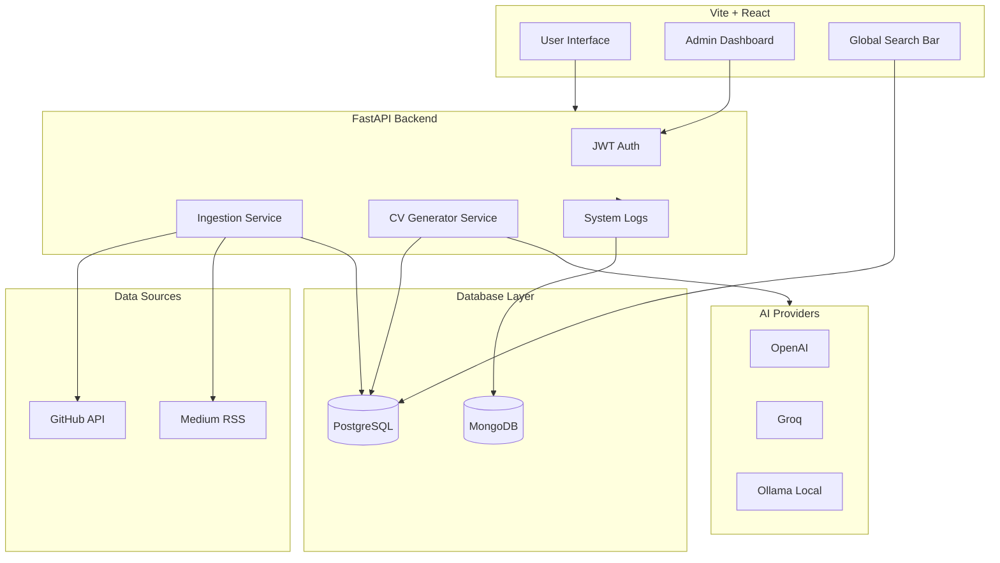

# ⚡ ResuMesh

> **An AI-powered, open-source smart portfolio aggregator and tailored CV generator.**

[](LICENSE)
[](https://fastapi.tiangolo.com/)
[](https://reactjs.org/)
[](https://www.postgresql.org/)

---

## 📌 Overview

ResuMesh is a self-hosted, dynamic portfolio hub designed for modern developers. Instead of maintaining static personal websites, ResuMesh continuously syncs your digital footprint from **GitHub**, **Medium**, and **Dev.to** into a single, unified database.

It features a lightning-fast **Global Search Bar** for recruiters to filter your skills instantly and an **AI-driven CV Generator** that scrapes job descriptions and generates a tailored, high-impact resume based on your actual career data.

### 🌟 Key Features

- 🔄 **Asynchronous Data Ingestion:** Automated nightly cron jobs that parse GitHub repositories, Medium XML RSS feeds, and Dev.to articles.
- 🔍 **Instant Global Search:** Multi-table text-search filtering across projects, articles, certificates, and experiences powered by PostgreSQL GIN and B-Tree indexes.
- 🤖 **Agnostic AI Resume Builder:** Built-in LLM integration via **LangChain** that automatically matches your background with scraped job postings to generate contextual Markdown/PDFs. Thanks to the Factory Pattern, you can seamlessly switch between **OpenAI**, **Groq**, **Ollama (Local)**, or a **Mock Provider** for testing.
- 🔐 **Bulletproof Security:** Secured admin dashboards powered by OAuth2 JWT authentication, rigorous CORS policies, and rate-limiting (Throttling) mechanisms via `slowapi`.
- 📊 **Structured Logging Pool:** A dedicated database log sink (accessible via `/admin`) to monitor background synchronization health, AI token usage, and system events directly from the UI.
- 🐳 **Dockerized Infrastructure:** Frontend, Backend, and Databases are containerized and orchestrated seamlessly using Docker Compose.

---

## 🏗️ System Architecture



---

## 🛠️ Tech Stack

- **Backend:** Python, FastAPI, SQLAlchemy ORM, APScheduler, Slowapi (Rate Limiting), PyJWT, LangChain, Jinja2 (Prompt Templates).
- **Frontend:** React (Vite), Tailwind CSS v4, Lucide React, Axios.
- **Database:** Agnostic Repository Pattern supporting **PostgreSQL** (with `JSONB` and array containment querying) and **MongoDB** (for logs/NoSQL usage).
- **DevOps:** Docker, Docker Compose, GitHub Actions (CI/CD), NGINX.

---

## 🚀 Getting Started

### Prerequisites

Before running the project locally, ensure you have the following installed:
- Docker and Docker Compose
- Node.js 20+ (If running frontend outside Docker)
- Python 3.11+ (If running backend outside Docker)

### Installation & Setup

1. **Clone the repository:**
   ```bash
   git clone https://github.com/AtaCanYmc/ResuMesh.git
   cd ResuMesh
   ```

2. **Environment Configuration:**
   Copy the example `.env` files and fill in your credentials.
   ```bash
   cp frontend/.env.example frontend/.env
   # Add your API keys to the backend environment variables or docker-compose.yml
   ```

3. **Run with Docker Compose (Recommended):**
   ```bash
   docker-compose up --build -d
   ```
   - The UI will be available at `http://localhost:3000`
   - The API will be available at `http://localhost:8000` (or `/api` via NGINX)
   - API Docs available at `http://localhost:8000/docs`

---

## 🧪 Running Tests

To execute the asynchronous test suite, run the following command inside the `backend` directory:

```bash
cd backend
python -m venv .venv
source .venv/bin/activate
pip install -r requirements.txt
PYTHONPATH=. pytest -v
```

---

## 🤝 Contributing

Contributions are welcome! Please check our [Contributing Guidelines](CONTRIBUTING.md) for details on how to submit a Pull Request, our code styling rules, and conventional commit standards.

---

## 📄 License

Distributed under the MIT License. See `LICENSE` for more information.
