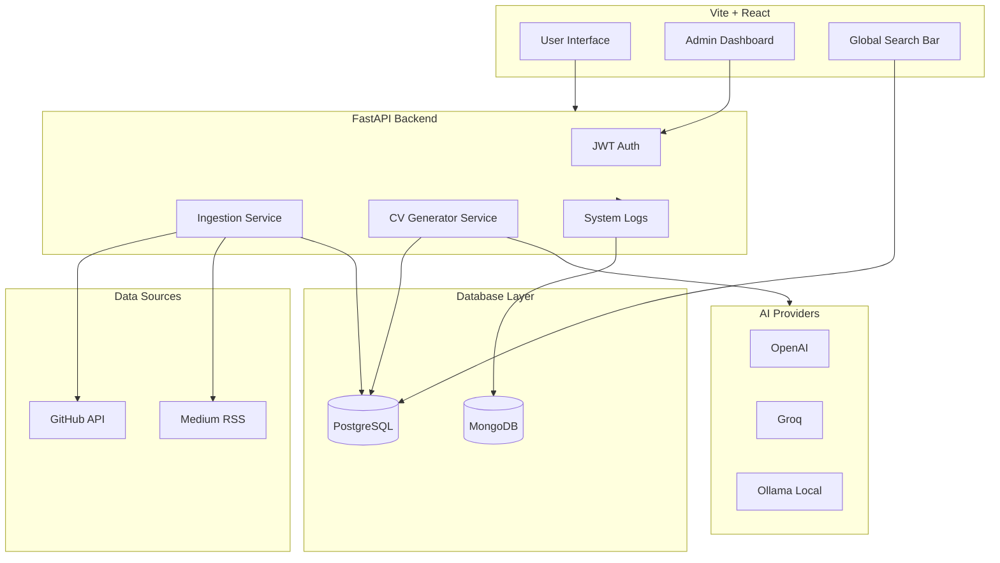

# ⚡ ResuMesh

> **An AI-powered, open-source smart portfolio aggregator and tailored CV generator.**

[](LICENSE)
[](https://fastapi.tiangolo.com/)
[](https://reactjs.org/)
[](https://www.postgresql.org/)

---

## 📌 Overview

ResuMesh is a self-hosted, dynamic portfolio hub designed for modern developers. Instead of maintaining static personal websites, ResuMesh continuously syncs your digital footprint from **GitHub**, **Medium**, and **Dev.to** into a single, unified database.

It features a lightning-fast **Global Search Bar** for recruiters to filter your skills instantly and an **AI-driven CV Generator** that scrapes job descriptions and generates a tailored, high-impact resume based on your actual career data.

## 📂 Project Structure & Component READMEs

- [/backend](./backend): FastAPI architecture, Database providers, Alembic migrations, AI CV Generator, and Pytest suite.
- [/frontend](./frontend): React + TypeScript client, Vite configuration, Tailwind CSS design system, and Oxlint rules.

---

## 🏗️ System Architecture



---

## 🚀 Global Docker Setup

### Prerequisites

Before running the project locally, ensure you have the following installed:
- Docker and Docker Compose

### Installation & Setup

1. **Clone the repository:**
   ```bash
   git clone https://github.com/AtaCanYmc/ResuMesh.git
   cd ResuMesh
   ```

2. **Environment Configuration:**
   Copy the example `.env` files and fill in your credentials.
   ```bash
   cp frontend/.env.example frontend/.env
   # Add your API keys to the backend environment variables or docker-compose.yml
   ```

3. **Run with Docker Compose (Profiles Supported):**
   The project uses Docker profiles to let you choose which database containers to spin up. The backend is agnostic and will connect to whatever you configured, making this setup highly flexible.

   **Run without databases (Backend + Frontend only):**
   ```bash
   docker compose up --build -d
   ```

   **Run with PostgreSQL:**
   ```bash
   docker compose --profile postgres up --build -d
   ```

   **Run with MongoDB:**
   ```bash
   docker compose --profile mongo up --build -d
   ```

   **Run with both databases:**
   ```bash
   docker compose --profile postgres --profile mongo up --build -d
   ```

   Once running:
   - The UI will be available at `http://localhost:3000`
   - The API will be available at `http://localhost:8000` (or `/api` via NGINX)
   - API Docs available at `http://localhost:8000/docs`

---

## 🤝 Contributing & Code Quality

Before submitting a pull request, make sure to install the **pre-commit** hooks to ensure consistent code styling:
```bash
pip install pre-commit
pre-commit install
```
This will automatically check linting rules on every commit.

Contributions are welcome! Please check our [Contributing Guidelines](CONTRIBUTING.md) for details on how to submit a Pull Request, our code styling rules, and conventional commit standards.

---

## 📄 License

Distributed under the MIT License. See `LICENSE` for more information.
