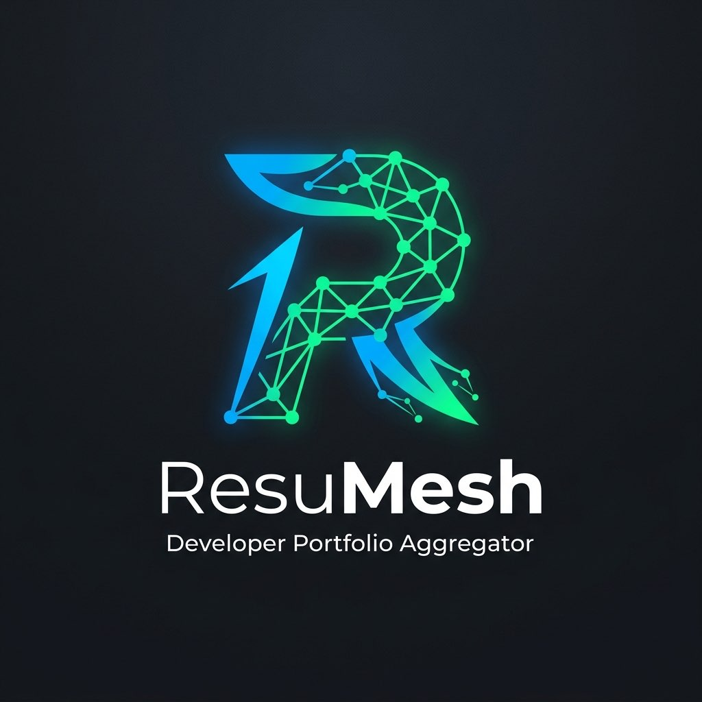
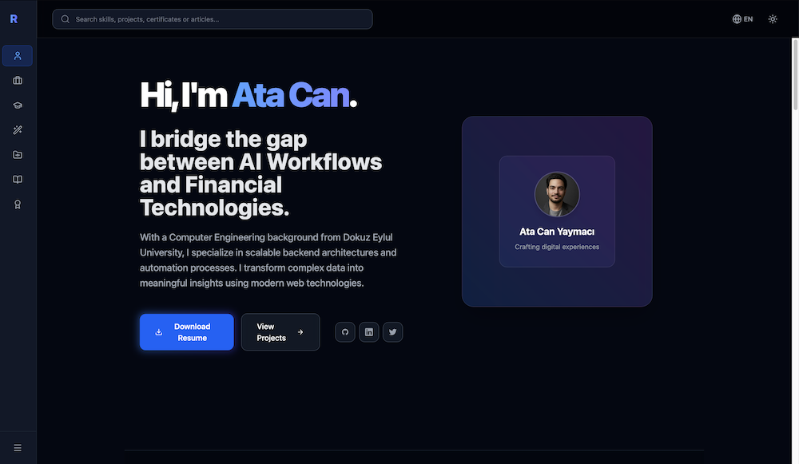
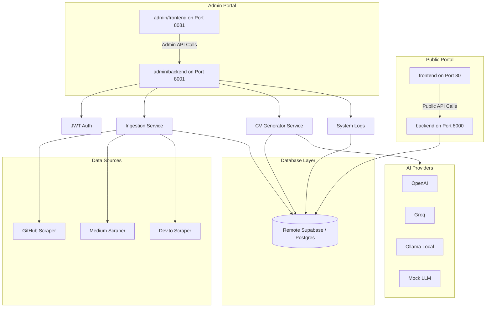

<p align="center">
  
</p>

# ⚡ ResuMesh

> **An AI-powered, open-source smart portfolio aggregator and tailored CV generator.**

[](LICENSE)
[](https://fastapi.tiangolo.com/)
[](https://reactjs.org/)
[](https://www.postgresql.org/)
[](https://storybook.js.org/)

---

## 📌 Overview



ResuMesh is a self-hosted, dynamic portfolio hub designed for modern developers. Instead of maintaining static personal websites, ResuMesh continuously syncs your digital footprint from **GitHub**, **Medium**, and **Dev.to** into a single, unified database.

It features:
- ⚡ **Global Search Bar**: Lightning-fast filtering of your skills, projects, and articles for recruiters.
- ✨ **AI CV Tailoring**: Groq/OpenAI integration for real-time, tailored PDF resume generation based on specific job descriptions.
- 🔄 **Continuous Sync**: Automatically aggregates your digital footprint into a single unified database.

---

## 📂 Project Structure & Component READMEs

- [/backend](./backend): Public read-only portfolio FastAPI service (Port 8000).
- [/frontend](./frontend): Public visitor-facing React + TypeScript portfolio UI (Port 80).
- [/admin](./admin): Dedicated administration panel folder containing:
  - [/admin/backend](./admin/backend): Private administrative FastAPI service (Port 8001).
  - [/admin/frontend](./admin/frontend): Private React administration client (Port 8081).

---

## 🏗️ System Architecture

ResuMesh isolates administrative modifications and AI CV generation operations from visitor-facing portfolio pages to ensure optimal security and resource limits.



---

## 🛠️ Architectural & Engineering Decisions (ADRs)

Architecture decisions in ResuMesh are documented and justified to maintain a clean, maintainable, and decoupled codebase.
- **[ADR-0001: Record Architecture Decisions](docs/adr/0001-record-architecture-decisions.md)**: Declares the use of ADRs.
- **[ADR-0002: Frontend Tech Stack](docs/adr/0002-frontend-tech-stack-vite-react-query.md)**: Justifies React, Vite, and React Query usage.

---

## 🔄 Product Flow: How it Works

1. **Continuous Aggregation**: You enter your developer handles (GitHub, Medium, Dev.to). The admin backend scrapers ingest all your projects, posts, and articles in the background.
2. **Context-Driven Search**: Recruiters search your profile through the lightning-fast, fuzzy-matching search bar.
3. **AI CV Generation**: You provide a target Job Description URL. The admin system gathers all your DB records, constructs a context-rich prompt, feeds it to the LLM (Groq/OpenAI), and renders a tailored Markdown/PDF CV.

---

## ⚙️ Quick Start with Mock Mode (API Key Free)

You can experience and test ResuMesh locally **without any OpenAI/Groq API keys**:
1. In `admin/backend/.env` (or `docker-compose.yml`), set the LLM provider to mock:
   ```env
   LLM_PROVIDER=mock
   ```
2. Spin up the containers. The application will generate mock CVs instantly without consuming any API quota!

---

## 🚀 Running the Application

### Installation & Setup

1. **Clone the repository:**
   ```bash
   git clone https://github.com/AtaCanYmc/ResuMesh.git
   cd ResuMesh
   ```

2. **Environment Configuration:**
   Copy the example `.env` files and fill in your credentials.
   ```bash
   cp frontend/.env.example frontend/.env
   cp admin/frontend/.env.example admin/frontend/.env
   cp backend/.env.example backend/.env
   cp admin/backend/.env.example admin/backend/.env
   ```

3. **Run with Docker Compose:**
   ```bash
   docker compose up --build -d
   ```

   Once running:
   - **Visitor UI**: `http://localhost`
   - **Admin UI**: `http://localhost:8081`
   - **Public Backend API**: `http://localhost:8000`
   - **Admin Backend API**: `http://localhost:8001`
   - **Interactive API Documentation (Swagger)**: `http://localhost:8000/docs`

---

## 🌍 Cloud Deployment

Looking to deploy ResuMesh using Vercel (Frontend), Render (Backend), and remote PostgreSQL (Supabase)?

Read our comprehensive guide here: **[DEPLOYMENT.md](docs/DEPLOYMENT.md)**

---

## 🗄️ Database Migrations (Alembic)

This project uses [Alembic](https://alembic.sqlalchemy.org/) to handle Supabase/PostgreSQL database migrations (Infrastructure as Code).

### Setting up Supabase / Remote DB
1. In `backend/.env` and `admin/backend/.env`, set your connection string:
   ```env
   DATABASE_URL=postgresql://[user]:[password]@[host]:6543/postgres
   ```

### Running Migrations via Docker
Because the backend container isolates its filesystem, you must mount your local volume when generating new migration files so they save to your local codebase:

**1. Create a new migration:**
```bash
docker compose run --rm -v $(pwd)/backend:/app backend alembic revision --autogenerate -m "your_message"
```

**2. Apply migrations to the database:**
```bash
docker compose run --rm backend alembic upgrade head
```

---

## 🤝 Contributing & Code Quality

Before submitting a pull request, make sure to install the **pre-commit** hooks to ensure consistent code styling.
*(Not: Bu proje hem Python hem de Node.js standartlarını korumak için pre-commit kullanır. Sadece frontend tarafına katkı yapacak olsanız bile sisteminizde Python kurulu olduğundan emin olun.)*
```bash
dev-commit install
```
This will automatically check linting rules on every commit.

Contributions are welcome! Please check our [Contributing Guidelines](CONTRIBUTING.md) for details on how to submit a Pull Request, our code styling rules, and conventional commit standards.

---

## 📄 License

Distributed under the Apache License 2.0. See `LICENSE` for more information.
