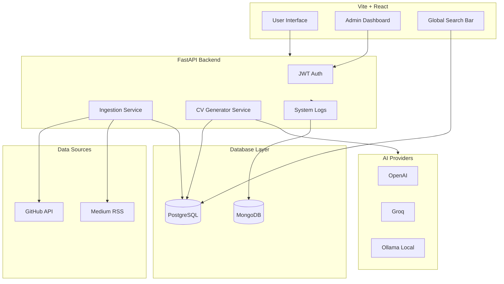

# ⚡ ResuMesh

> **An AI-powered, open-source smart portfolio aggregator and tailored CV generator.**

[](LICENSE)
[](https://fastapi.tiangolo.com/)
[](https://reactjs.org/)
[](https://www.postgresql.org/)

---

## 📌 Overview


ResuMesh is a self-hosted, dynamic portfolio hub designed for modern developers. Instead of maintaining static personal websites, ResuMesh continuously syncs your digital footprint from **GitHub**, **Medium**, and **Dev.to** into a single, unified database.

It features:
- ⚡ **Global Search Bar**: Lightning-fast filtering of your skills, projects, and articles for recruiters.
- ✨ **AI CV Tailoring**: Groq/OpenAI integration for real-time, tailored PDF resume generation based on specific job descriptions.
- 🔄 **Continuous Sync**: Automatically aggregates your digital footprint into a single unified database.

## 📂 Project Structure & Component READMEs

- [/backend](./backend): FastAPI architecture, Database providers, Alembic migrations, AI CV Generator, and Pytest suite.
- [/frontend](./frontend): React + TypeScript client, Vite configuration, Tailwind CSS design system, and Oxlint rules.

---

## 🏗️ System Architecture



---

## 🚀 Global Docker Setup

### Prerequisites

Before running the project locally, ensure you have the following installed:
- Docker and Docker Compose

### Installation & Setup

1. **Clone the repository:**
   ```bash
   git clone https://github.com/AtaCanYmc/ResuMesh.git
   cd ResuMesh
   ```

2. **Environment Configuration:**
   Copy the example `.env` files and fill in your credentials.
   ```bash
   cp frontend/.env.example frontend/.env
   # Add your API keys to the backend environment variables or docker-compose.yml
   ```

3. **Run with Docker Compose (Profiles Supported):**
   The project uses Docker profiles to let you choose which database containers to spin up. The backend is agnostic and will connect to whatever you configured, making this setup highly flexible.

   **Run without databases (Backend + Frontend only):**
   ```bash
   docker compose up --build -d
   ```

   **Run with PostgreSQL:**
   ```bash
   docker compose --profile postgres up --build -d
   ```

   **Run with MongoDB:**
   ```bash
   docker compose --profile mongo up --build -d
   ```

   **Run with both databases:**
   ```bash
   docker compose --profile postgres --profile mongo up --build -d
   ```

   Once running:
   - The UI will be available at `http://localhost:3000`
   - The API will be available at `http://localhost:8000` (or `/api` via NGINX)
   - API Docs available at `http://localhost:8000/docs`

---

## 🗄️ Database Migrations (Alembic)

This project uses [Alembic](https://alembic.sqlalchemy.org/) to handle PostgreSQL database migrations (Infrastructure as Code).

### Setting up Supabase / Remote DB
1. In `backend/.env`, set your pooler connection string (e.g., Supabase Port 6543):
   ```env
   DATABASE_URL=postgresql://[user]:[password]@[host]:6543/postgres
   ```

### Running Migrations via Docker
Because the backend container isolates its filesystem, you must mount your local volume when generating new migration files so they save to your local codebase:

**1. Create a new migration:**
```bash
docker compose run --rm -v $(pwd)/backend:/app backend alembic revision --autogenerate -m "your_message"
```

**2. Apply migrations to the database:**
```bash
docker compose run --rm backend alembic upgrade head
```

---

## 🤝 Contributing & Code Quality

Before submitting a pull request, make sure to install the **pre-commit** hooks to ensure consistent code styling.
*(Not: Bu proje hem Python hem de Node.js standartlarını korumak için pre-commit kullanır. Sadece frontend tarafına katkı yapacak olsanız bile sisteminizde Python kurulu olduğundan emin olun.)*
```bash
pip install pre-commit
pre-commit install
```
This will automatically check linting rules on every commit.

Contributions are welcome! Please check our [Contributing Guidelines](CONTRIBUTING.md) for details on how to submit a Pull Request, our code styling rules, and conventional commit standards.

---

## 📄 License

Distributed under the Apache License 2.0. See `LICENSE` for more information.
